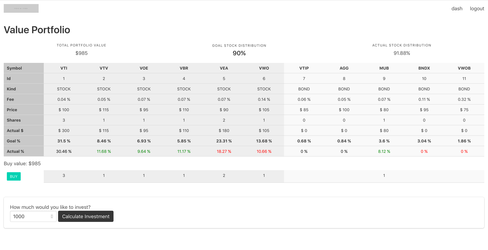

# fin

 Financial porfolio manager.



---
### Talk
I gave a talk at Rust Belt Rust (2019):
`https://github.com/toidiu/talk_rust_belt_rust_2019`

### Website
Vue, Typescript, parceljs

#### Requirements
- npm 6.7.0
- node 11.10.0

#### Setup
```
cd website
npm start
```

---

### Postgres Database

#### Requirements
- https://github.com/diesel-rs/diesel/tree/master/diesel_cli
- local postgres instance (https://postgresapp.com)

#### Setup
```
cd service
make run
```

---

### Server
Rust

#### Requirements
- cargo 1.32.0

#### Setup
```
cd service
cargo run

(optional) replace information in `fin_config/*.toml` to configure application
```

---

### IEX
Switch mode by replacing dependency in file `/fin/service/fin/Cargo.toml`.

- *fake data (default)*: the `iex-rs` crate is compiles as `source_debug` by default
which generates deterministic fake prices for stocks. It is a good way to quickly get
started and work without an internet connection.

- *real data*: for real data register for a free account at [iex cloud](https://iexcloud.io)
and replace token in `fin_config/development.toml`.

---

### Running the Application
```
http://localhost:1234/
username: apoorv@toidu.com
password: 123456
```


---
### Server setup

```
apt-get update && apt-get upgrade
dpkg-reconfigure tzdata
hostnamectl set-hostname example_hostname


adduser toidiu - toidiur0cks
adduser toidiu sudo
/etc/sudoers file add this line:
  toidiu     ALL=(ALL) NOPASSWD:ALL
su toidiu
mkdir ~/.ssh
local - scp ~/.ssh/id_rsa.pub toidiu@____:~/.ssh/authorized_keys


/etc/ssh/sshd_config
    PermitRootLogin no
    PasswordAuthentication no
echo 'AddressFamily inet' | sudo tee -a /etc/ssh/sshd_config
sudo systemctl restart sshd


sudo apt-get install postgresql postgresql-contrib
sudo passwd postgres
su - postgres
psql -d template1 -c "ALTER USER postgres WITH PASSWORD '____';"

createdb fin-prod

```

